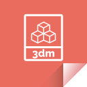
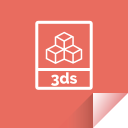

# List of icons

[Download all icons](https://github.com/sempostma/cc0-file-icons/archive/master.zip)

[Open README](README.md)

[CC0](LICENSE)

## 3dm.svg

### Download

- [[PNG] Black](https://github.com/sempostma/cc0-file-icons/raw/master/black/png/3dm.png)
- [[SVG] Black](https://github.com/sempostma/cc0-file-icons/raw/master/black/svg/3dm.svg)
- [[PNG] White](https://github.com/sempostma/cc0-file-icons/raw/master/white/png/3dm.png)
- [[SVG] White](https://github.com/sempostma/cc0-file-icons/raw/master/white/svg/3dm.svg)
- [[PNG] Background](https://github.com/sempostma/cc0-file-icons/raw/master/background/png/3dm.png)
- [[SVG] Background](https://github.com/sempostma/cc0-file-icons/raw/master/background/svg/3dm.svg)

## 3ds.svg

### Download

- [[PNG] Black](https://github.com/sempostma/cc0-file-icons/raw/master/black/png/3ds.png)
- [[SVG] Black](https://github.com/sempostma/cc0-file-icons/raw/master/black/svg/3ds.svg)
- [[PNG] White](https://github.com/sempostma/cc0-file-icons/raw/master/white/png/3ds.png)
- [[SVG] White](https://github.com/sempostma/cc0-file-icons/raw/master/white/svg/3ds.svg)
- [[PNG] Background](https://github.com/sempostma/cc0-file-icons/raw/master/background/png/3ds.png)
- [[SVG] Background](https://github.com/sempostma/cc0-file-icons/raw/master/background/svg/3ds.svg)

## 3g2.svg

### Download

- [[PNG] Black](https://github.com/sempostma/cc0-file-icons/raw/master/black/png/3g2.png)
- [[SVG] Black](https://github.com/sempostma/cc0-file-icons/raw/master/black/svg/3g2.svg)
- [[PNG] White](https://github.com/sempostma/cc0-file-icons/raw/master/white/png/3g2.png)
- [[SVG] White](https://github.com/sempostma/cc0-file-icons/raw/master/white/svg/3g2.svg)
- [[PNG] Background](https://github.com/sempostma/cc0-file-icons/raw/master/background/png/3g2.png)
- [[SVG] Background](https://github.com/sempostma/cc0-file-icons/raw/master/background/svg/3g2.svg)

## 3gp.svg

### Download

- [[PNG] Black](https://github.com/sempostma/cc0-file-icons/raw/master/black/png/3gp.png)
- [[SVG] Black](https://github.com/sempostma/cc0-file-icons/raw/master/black/svg/3gp.svg)
- [[PNG] White](https://github.com/sempostma/cc0-file-icons/raw/master/white/png/3gp.png)
- [[SVG] White](https://github.com/sempostma/cc0-file-icons/raw/master/white/svg/3gp.svg)
- [[PNG] Background](https://github.com/sempostma/cc0-file-icons/raw/master/background/png/3gp.png)
- [[SVG] Background](https://github.com/sempostma/cc0-file-icons/raw/master/background/svg/3gp.svg)

## accdb.svg

### Download

- [[PNG] Black](https://github.com/sempostma/cc0-file-icons/raw/master/black/png/accdb.png)
- [[SVG] Black](https://github.com/sempostma/cc0-file-icons/raw/master/black/svg/accdb.svg)
- [[PNG] White](https://github.com/sempostma/cc0-file-icons/raw/master/white/png/accdb.png)
- [[SVG] White](https://github.com/sempostma/cc0-file-icons/raw/master/white/svg/accdb.svg)
- [[PNG] Background](https://github.com/sempostma/cc0-file-icons/raw/master/background/png/accdb.png)
- [[SVG] Background](https://github.com/sempostma/cc0-file-icons/raw/master/background/svg/accdb.svg)

## ai.svg

### Download

- [[PNG] Black](https://github.com/sempostma/cc0-file-icons/raw/master/black/png/ai.png)
- [[SVG] Black](https://github.com/sempostma/cc0-file-icons/raw/master/black/svg/ai.svg)
- [[PNG] White](https://github.com/sempostma/cc0-file-icons/raw/master/white/png/ai.png)
- [[SVG] White](https://github.com/sempostma/cc0-file-icons/raw/master/white/svg/ai.svg)
- [[PNG] Background](https://github.com/sempostma/cc0-file-icons/raw/master/background/png/ai.png)
- [[SVG] Background](https://github.com/sempostma/cc0-file-icons/raw/master/background/svg/ai.svg)

## aif.svg

### Download

- [[PNG] Black](https://github.com/sempostma/cc0-file-icons/raw/master/black/png/aif.png)
- [[SVG] Black](https://github.com/sempostma/cc0-file-icons/raw/master/black/svg/aif.svg)
- [[PNG] White](https://github.com/sempostma/cc0-file-icons/raw/master/white/png/aif.png)
- [[SVG] White](https://github.com/sempostma/cc0-file-icons/raw/master/white/svg/aif.svg)
- [[PNG] Background](https://github.com/sempostma/cc0-file-icons/raw/master/background/png/aif.png)
- [[SVG] Background](https://github.com/sempostma/cc0-file-icons/raw/master/background/svg/aif.svg)

## apk.svg

### Download

- [[PNG] Black](https://github.com/sempostma/cc0-file-icons/raw/master/black/png/apk.png)
- [[SVG] Black](https://github.com/sempostma/cc0-file-icons/raw/master/black/svg/apk.svg)
- [[PNG] White](https://github.com/sempostma/cc0-file-icons/raw/master/white/png/apk.png)
- [[SVG] White](https://github.com/sempostma/cc0-file-icons/raw/master/white/svg/apk.svg)
- [[PNG] Background](https://github.com/sempostma/cc0-file-icons/raw/master/background/png/apk.png)
- [[SVG] Background](https://github.com/sempostma/cc0-file-icons/raw/master/background/svg/apk.svg)

## asf.svg

### Download

- [[PNG] Black](https://github.com/sempostma/cc0-file-icons/raw/master/black/png/asf.png)
- [[SVG] Black](https://github.com/sempostma/cc0-file-icons/raw/master/black/svg/asf.svg)
- [[PNG] White](https://github.com/sempostma/cc0-file-icons/raw/master/white/png/asf.png)
- [[SVG] White](https://github.com/sempostma/cc0-file-icons/raw/master/white/svg/asf.svg)
- [[PNG] Background](https://github.com/sempostma/cc0-file-icons/raw/master/background/png/asf.png)
- [[SVG] Background](https://github.com/sempostma/cc0-file-icons/raw/master/background/svg/asf.svg)

## avi.svg

### Download

- [[PNG] Black](https://github.com/sempostma/cc0-file-icons/raw/master/black/png/avi.png)
- [[SVG] Black](https://github.com/sempostma/cc0-file-icons/raw/master/black/svg/avi.svg)
- [[PNG] White](https://github.com/sempostma/cc0-file-icons/raw/master/white/png/avi.png)
- [[SVG] White](https://github.com/sempostma/cc0-file-icons/raw/master/white/svg/avi.svg)
- [[PNG] Background](https://github.com/sempostma/cc0-file-icons/raw/master/background/png/avi.png)
- [[SVG] Background](https://github.com/sempostma/cc0-file-icons/raw/master/background/svg/avi.svg)

## bat.svg

### Download

- [[PNG] Black](https://github.com/sempostma/cc0-file-icons/raw/master/black/png/bat.png)
- [[SVG] Black](https://github.com/sempostma/cc0-file-icons/raw/master/black/svg/bat.svg)
- [[PNG] White](https://github.com/sempostma/cc0-file-icons/raw/master/white/png/bat.png)
- [[SVG] White](https://github.com/sempostma/cc0-file-icons/raw/master/white/svg/bat.svg)
- [[PNG] Background](https://github.com/sempostma/cc0-file-icons/raw/master/background/png/bat.png)
- [[SVG] Background](https://github.com/sempostma/cc0-file-icons/raw/master/background/svg/bat.svg)

## bmp.svg

### Download

- [[PNG] Black](https://github.com/sempostma/cc0-file-icons/raw/master/black/png/bmp.png)
- [[SVG] Black](https://github.com/sempostma/cc0-file-icons/raw/master/black/svg/bmp.svg)
- [[PNG] White](https://github.com/sempostma/cc0-file-icons/raw/master/white/png/bmp.png)
- [[SVG] White](https://github.com/sempostma/cc0-file-icons/raw/master/white/svg/bmp.svg)
- [[PNG] Background](https://github.com/sempostma/cc0-file-icons/raw/master/background/png/bmp.png)
- [[SVG] Background](https://github.com/sempostma/cc0-file-icons/raw/master/background/svg/bmp.svg)

## cgi.svg

### Download

- [[PNG] Black](https://github.com/sempostma/cc0-file-icons/raw/master/black/png/cgi.png)
- [[SVG] Black](https://github.com/sempostma/cc0-file-icons/raw/master/black/svg/cgi.svg)
- [[PNG] White](https://github.com/sempostma/cc0-file-icons/raw/master/white/png/cgi.png)
- [[SVG] White](https://github.com/sempostma/cc0-file-icons/raw/master/white/svg/cgi.svg)
- [[PNG] Background](https://github.com/sempostma/cc0-file-icons/raw/master/background/png/cgi.png)
- [[SVG] Background](https://github.com/sempostma/cc0-file-icons/raw/master/background/svg/cgi.svg)

## com.svg

### Download

- [[PNG] Black](https://github.com/sempostma/cc0-file-icons/raw/master/black/png/com.png)
- [[SVG] Black](https://github.com/sempostma/cc0-file-icons/raw/master/black/svg/com.svg)
- [[PNG] White](https://github.com/sempostma/cc0-file-icons/raw/master/white/png/com.png)
- [[SVG] White](https://github.com/sempostma/cc0-file-icons/raw/master/white/svg/com.svg)
- [[PNG] Background](https://github.com/sempostma/cc0-file-icons/raw/master/background/png/com.png)
- [[SVG] Background](https://github.com/sempostma/cc0-file-icons/raw/master/background/svg/com.svg)

## csv.svg

### Download

- [[PNG] Black](https://github.com/sempostma/cc0-file-icons/raw/master/black/png/csv.png)
- [[SVG] Black](https://github.com/sempostma/cc0-file-icons/raw/master/black/svg/csv.svg)
- [[PNG] White](https://github.com/sempostma/cc0-file-icons/raw/master/white/png/csv.png)
- [[SVG] White](https://github.com/sempostma/cc0-file-icons/raw/master/white/svg/csv.svg)
- [[PNG] Background](https://github.com/sempostma/cc0-file-icons/raw/master/background/png/csv.png)
- [[SVG] Background](https://github.com/sempostma/cc0-file-icons/raw/master/background/svg/csv.svg)

## dat.svg

### Download

- [[PNG] Black](https://github.com/sempostma/cc0-file-icons/raw/master/black/png/dat.png)
- [[SVG] Black](https://github.com/sempostma/cc0-file-icons/raw/master/black/svg/dat.svg)
- [[PNG] White](https://github.com/sempostma/cc0-file-icons/raw/master/white/png/dat.png)
- [[SVG] White](https://github.com/sempostma/cc0-file-icons/raw/master/white/svg/dat.svg)
- [[PNG] Background](https://github.com/sempostma/cc0-file-icons/raw/master/background/png/dat.png)
- [[SVG] Background](https://github.com/sempostma/cc0-file-icons/raw/master/background/svg/dat.svg)

## db.svg

### Download

- [[PNG] Black](https://github.com/sempostma/cc0-file-icons/raw/master/black/png/db.png)
- [[SVG] Black](https://github.com/sempostma/cc0-file-icons/raw/master/black/svg/db.svg)
- [[PNG] White](https://github.com/sempostma/cc0-file-icons/raw/master/white/png/db.png)
- [[SVG] White](https://github.com/sempostma/cc0-file-icons/raw/master/white/svg/db.svg)
- [[PNG] Background](https://github.com/sempostma/cc0-file-icons/raw/master/background/png/db.png)
- [[SVG] Background](https://github.com/sempostma/cc0-file-icons/raw/master/background/svg/db.svg)

## dbf.svg

### Download

- [[PNG] Black](https://github.com/sempostma/cc0-file-icons/raw/master/black/png/dbf.png)
- [[SVG] Black](https://github.com/sempostma/cc0-file-icons/raw/master/black/svg/dbf.svg)
- [[PNG] White](https://github.com/sempostma/cc0-file-icons/raw/master/white/png/dbf.png)
- [[SVG] White](https://github.com/sempostma/cc0-file-icons/raw/master/white/svg/dbf.svg)
- [[PNG] Background](https://github.com/sempostma/cc0-file-icons/raw/master/background/png/dbf.png)
- [[SVG] Background](https://github.com/sempostma/cc0-file-icons/raw/master/background/svg/dbf.svg)

## dds.svg

### Download

- [[PNG] Black](https://github.com/sempostma/cc0-file-icons/raw/master/black/png/dds.png)
- [[SVG] Black](https://github.com/sempostma/cc0-file-icons/raw/master/black/svg/dds.svg)
- [[PNG] White](https://github.com/sempostma/cc0-file-icons/raw/master/white/png/dds.png)
- [[SVG] White](https://github.com/sempostma/cc0-file-icons/raw/master/white/svg/dds.svg)
- [[PNG] Background](https://github.com/sempostma/cc0-file-icons/raw/master/background/png/dds.png)
- [[SVG] Background](https://github.com/sempostma/cc0-file-icons/raw/master/background/svg/dds.svg)

## doc.svg

### Download

- [[PNG] Black](https://github.com/sempostma/cc0-file-icons/raw/master/black/png/doc.png)
- [[SVG] Black](https://github.com/sempostma/cc0-file-icons/raw/master/black/svg/doc.svg)
- [[PNG] White](https://github.com/sempostma/cc0-file-icons/raw/master/white/png/doc.png)
- [[SVG] White](https://github.com/sempostma/cc0-file-icons/raw/master/white/svg/doc.svg)
- [[PNG] Background](https://github.com/sempostma/cc0-file-icons/raw/master/background/png/doc.png)
- [[SVG] Background](https://github.com/sempostma/cc0-file-icons/raw/master/background/svg/doc.svg)

## docx.svg

### Download

- [[PNG] Black](https://github.com/sempostma/cc0-file-icons/raw/master/black/png/docx.png)
- [[SVG] Black](https://github.com/sempostma/cc0-file-icons/raw/master/black/svg/docx.svg)
- [[PNG] White](https://github.com/sempostma/cc0-file-icons/raw/master/white/png/docx.png)
- [[SVG] White](https://github.com/sempostma/cc0-file-icons/raw/master/white/svg/docx.svg)
- [[PNG] Background](https://github.com/sempostma/cc0-file-icons/raw/master/background/png/docx.png)
- [[SVG] Background](https://github.com/sempostma/cc0-file-icons/raw/master/background/svg/docx.svg)

## eps.svg

### Download

- [[PNG] Black](https://github.com/sempostma/cc0-file-icons/raw/master/black/png/eps.png)
- [[SVG] Black](https://github.com/sempostma/cc0-file-icons/raw/master/black/svg/eps.svg)
- [[PNG] White](https://github.com/sempostma/cc0-file-icons/raw/master/white/png/eps.png)
- [[SVG] White](https://github.com/sempostma/cc0-file-icons/raw/master/white/svg/eps.svg)
- [[PNG] Background](https://github.com/sempostma/cc0-file-icons/raw/master/background/png/eps.png)
- [[SVG] Background](https://github.com/sempostma/cc0-file-icons/raw/master/background/svg/eps.svg)

## exe.svg

### Download

- [[PNG] Black](https://github.com/sempostma/cc0-file-icons/raw/master/black/png/exe.png)
- [[SVG] Black](https://github.com/sempostma/cc0-file-icons/raw/master/black/svg/exe.svg)
- [[PNG] White](https://github.com/sempostma/cc0-file-icons/raw/master/white/png/exe.png)
- [[SVG] White](https://github.com/sempostma/cc0-file-icons/raw/master/white/svg/exe.svg)
- [[PNG] Background](https://github.com/sempostma/cc0-file-icons/raw/master/background/png/exe.png)
- [[SVG] Background](https://github.com/sempostma/cc0-file-icons/raw/master/background/svg/exe.svg)

## ged.svg

### Download

- [[PNG] Black](https://github.com/sempostma/cc0-file-icons/raw/master/black/png/ged.png)
- [[SVG] Black](https://github.com/sempostma/cc0-file-icons/raw/master/black/svg/ged.svg)
- [[PNG] White](https://github.com/sempostma/cc0-file-icons/raw/master/white/png/ged.png)
- [[SVG] White](https://github.com/sempostma/cc0-file-icons/raw/master/white/svg/ged.svg)
- [[PNG] Background](https://github.com/sempostma/cc0-file-icons/raw/master/background/png/ged.png)
- [[SVG] Background](https://github.com/sempostma/cc0-file-icons/raw/master/background/svg/ged.svg)

## gif.svg

### Download

- [[PNG] Black](https://github.com/sempostma/cc0-file-icons/raw/master/black/png/gif.png)
- [[SVG] Black](https://github.com/sempostma/cc0-file-icons/raw/master/black/svg/gif.svg)
- [[PNG] White](https://github.com/sempostma/cc0-file-icons/raw/master/white/png/gif.png)
- [[SVG] White](https://github.com/sempostma/cc0-file-icons/raw/master/white/svg/gif.svg)
- [[PNG] Background](https://github.com/sempostma/cc0-file-icons/raw/master/background/png/gif.png)
- [[SVG] Background](https://github.com/sempostma/cc0-file-icons/raw/master/background/svg/gif.svg)

## heic.svg

### Download

- [[PNG] Black](https://github.com/sempostma/cc0-file-icons/raw/master/black/png/heic.png)
- [[SVG] Black](https://github.com/sempostma/cc0-file-icons/raw/master/black/svg/heic.svg)
- [[PNG] White](https://github.com/sempostma/cc0-file-icons/raw/master/white/png/heic.png)
- [[SVG] White](https://github.com/sempostma/cc0-file-icons/raw/master/white/svg/heic.svg)
- [[PNG] Background](https://github.com/sempostma/cc0-file-icons/raw/master/background/png/heic.png)
- [[SVG] Background](https://github.com/sempostma/cc0-file-icons/raw/master/background/svg/heic.svg)

## iff.svg

### Download

- [[PNG] Black](https://github.com/sempostma/cc0-file-icons/raw/master/black/png/iff.png)
- [[SVG] Black](https://github.com/sempostma/cc0-file-icons/raw/master/black/svg/iff.svg)
- [[PNG] White](https://github.com/sempostma/cc0-file-icons/raw/master/white/png/iff.png)
- [[SVG] White](https://github.com/sempostma/cc0-file-icons/raw/master/white/svg/iff.svg)
- [[PNG] Background](https://github.com/sempostma/cc0-file-icons/raw/master/background/png/iff.png)
- [[SVG] Background](https://github.com/sempostma/cc0-file-icons/raw/master/background/svg/iff.svg)

## jpg.svg

### Download

- [[PNG] Black](https://github.com/sempostma/cc0-file-icons/raw/master/black/png/jpg.png)
- [[SVG] Black](https://github.com/sempostma/cc0-file-icons/raw/master/black/svg/jpg.svg)
- [[PNG] White](https://github.com/sempostma/cc0-file-icons/raw/master/white/png/jpg.png)
- [[SVG] White](https://github.com/sempostma/cc0-file-icons/raw/master/white/svg/jpg.svg)
- [[PNG] Background](https://github.com/sempostma/cc0-file-icons/raw/master/background/png/jpg.png)
- [[SVG] Background](https://github.com/sempostma/cc0-file-icons/raw/master/background/svg/jpg.svg)

## key.svg

### Download

- [[PNG] Black](https://github.com/sempostma/cc0-file-icons/raw/master/black/png/key.png)
- [[SVG] Black](https://github.com/sempostma/cc0-file-icons/raw/master/black/svg/key.svg)
- [[PNG] White](https://github.com/sempostma/cc0-file-icons/raw/master/white/png/key.png)
- [[SVG] White](https://github.com/sempostma/cc0-file-icons/raw/master/white/svg/key.svg)
- [[PNG] Background](https://github.com/sempostma/cc0-file-icons/raw/master/background/png/key.png)
- [[SVG] Background](https://github.com/sempostma/cc0-file-icons/raw/master/background/svg/key.svg)

## keychain.svg

### Download

- [[PNG] Black](https://github.com/sempostma/cc0-file-icons/raw/master/black/png/keychain.png)
- [[SVG] Black](https://github.com/sempostma/cc0-file-icons/raw/master/black/svg/keychain.svg)
- [[PNG] White](https://github.com/sempostma/cc0-file-icons/raw/master/white/png/keychain.png)
- [[SVG] White](https://github.com/sempostma/cc0-file-icons/raw/master/white/svg/keychain.svg)
- [[PNG] Background](https://github.com/sempostma/cc0-file-icons/raw/master/background/png/keychain.png)
- [[SVG] Background](https://github.com/sempostma/cc0-file-icons/raw/master/background/svg/keychain.svg)

## log.svg

### Download

- [[PNG] Black](https://github.com/sempostma/cc0-file-icons/raw/master/black/png/log.png)
- [[SVG] Black](https://github.com/sempostma/cc0-file-icons/raw/master/black/svg/log.svg)
- [[PNG] White](https://github.com/sempostma/cc0-file-icons/raw/master/white/png/log.png)
- [[SVG] White](https://github.com/sempostma/cc0-file-icons/raw/master/white/svg/log.svg)
- [[PNG] Background](https://github.com/sempostma/cc0-file-icons/raw/master/background/png/log.png)
- [[SVG] Background](https://github.com/sempostma/cc0-file-icons/raw/master/background/svg/log.svg)

## m4a.svg

### Download

- [[PNG] Black](https://github.com/sempostma/cc0-file-icons/raw/master/black/png/m4a.png)
- [[SVG] Black](https://github.com/sempostma/cc0-file-icons/raw/master/black/svg/m4a.svg)
- [[PNG] White](https://github.com/sempostma/cc0-file-icons/raw/master/white/png/m4a.png)
- [[SVG] White](https://github.com/sempostma/cc0-file-icons/raw/master/white/svg/m4a.svg)
- [[PNG] Background](https://github.com/sempostma/cc0-file-icons/raw/master/background/png/m4a.png)
- [[SVG] Background](https://github.com/sempostma/cc0-file-icons/raw/master/background/svg/m4a.svg)

## m4v.svg

### Download

- [[PNG] Black](https://github.com/sempostma/cc0-file-icons/raw/master/black/png/m4v.png)
- [[SVG] Black](https://github.com/sempostma/cc0-file-icons/raw/master/black/svg/m4v.svg)
- [[PNG] White](https://github.com/sempostma/cc0-file-icons/raw/master/white/png/m4v.png)
- [[SVG] White](https://github.com/sempostma/cc0-file-icons/raw/master/white/svg/m4v.svg)
- [[PNG] Background](https://github.com/sempostma/cc0-file-icons/raw/master/background/png/m4v.png)
- [[SVG] Background](https://github.com/sempostma/cc0-file-icons/raw/master/background/svg/m4v.svg)

## max.svg

### Download

- [[PNG] Black](https://github.com/sempostma/cc0-file-icons/raw/master/black/png/max.png)
- [[SVG] Black](https://github.com/sempostma/cc0-file-icons/raw/master/black/svg/max.svg)
- [[PNG] White](https://github.com/sempostma/cc0-file-icons/raw/master/white/png/max.png)
- [[SVG] White](https://github.com/sempostma/cc0-file-icons/raw/master/white/svg/max.svg)
- [[PNG] Background](https://github.com/sempostma/cc0-file-icons/raw/master/background/png/max.png)
- [[SVG] Background](https://github.com/sempostma/cc0-file-icons/raw/master/background/svg/max.svg)

## mdb.svg

### Download

- [[PNG] Black](https://github.com/sempostma/cc0-file-icons/raw/master/black/png/mdb.png)
- [[SVG] Black](https://github.com/sempostma/cc0-file-icons/raw/master/black/svg/mdb.svg)
- [[PNG] White](https://github.com/sempostma/cc0-file-icons/raw/master/white/png/mdb.png)
- [[SVG] White](https://github.com/sempostma/cc0-file-icons/raw/master/white/svg/mdb.svg)
- [[PNG] Background](https://github.com/sempostma/cc0-file-icons/raw/master/background/png/mdb.png)
- [[SVG] Background](https://github.com/sempostma/cc0-file-icons/raw/master/background/svg/mdb.svg)

## mid.svg

### Download

- [[PNG] Black](https://github.com/sempostma/cc0-file-icons/raw/master/black/png/mid.png)
- [[SVG] Black](https://github.com/sempostma/cc0-file-icons/raw/master/black/svg/mid.svg)
- [[PNG] White](https://github.com/sempostma/cc0-file-icons/raw/master/white/png/mid.png)
- [[SVG] White](https://github.com/sempostma/cc0-file-icons/raw/master/white/svg/mid.svg)
- [[PNG] Background](https://github.com/sempostma/cc0-file-icons/raw/master/background/png/mid.png)
- [[SVG] Background](https://github.com/sempostma/cc0-file-icons/raw/master/background/svg/mid.svg)

## mov.svg

### Download

- [[PNG] Black](https://github.com/sempostma/cc0-file-icons/raw/master/black/png/mov.png)
- [[SVG] Black](https://github.com/sempostma/cc0-file-icons/raw/master/black/svg/mov.svg)
- [[PNG] White](https://github.com/sempostma/cc0-file-icons/raw/master/white/png/mov.png)
- [[SVG] White](https://github.com/sempostma/cc0-file-icons/raw/master/white/svg/mov.svg)
- [[PNG] Background](https://github.com/sempostma/cc0-file-icons/raw/master/background/png/mov.png)
- [[SVG] Background](https://github.com/sempostma/cc0-file-icons/raw/master/background/svg/mov.svg)

## mp3.svg

### Download

- [[PNG] Black](https://github.com/sempostma/cc0-file-icons/raw/master/black/png/mp3.png)
- [[SVG] Black](https://github.com/sempostma/cc0-file-icons/raw/master/black/svg/mp3.svg)
- [[PNG] White](https://github.com/sempostma/cc0-file-icons/raw/master/white/png/mp3.png)
- [[SVG] White](https://github.com/sempostma/cc0-file-icons/raw/master/white/svg/mp3.svg)
- [[PNG] Background](https://github.com/sempostma/cc0-file-icons/raw/master/background/png/mp3.png)
- [[SVG] Background](https://github.com/sempostma/cc0-file-icons/raw/master/background/svg/mp3.svg)

## mp4.svg

### Download

- [[PNG] Black](https://github.com/sempostma/cc0-file-icons/raw/master/black/png/mp4.png)
- [[SVG] Black](https://github.com/sempostma/cc0-file-icons/raw/master/black/svg/mp4.svg)
- [[PNG] White](https://github.com/sempostma/cc0-file-icons/raw/master/white/png/mp4.png)
- [[SVG] White](https://github.com/sempostma/cc0-file-icons/raw/master/white/svg/mp4.svg)
- [[PNG] Background](https://github.com/sempostma/cc0-file-icons/raw/master/background/png/mp4.png)
- [[SVG] Background](https://github.com/sempostma/cc0-file-icons/raw/master/background/svg/mp4.svg)

## mpa.svg

### Download

- [[PNG] Black](https://github.com/sempostma/cc0-file-icons/raw/master/black/png/mpa.png)
- [[SVG] Black](https://github.com/sempostma/cc0-file-icons/raw/master/black/svg/mpa.svg)
- [[PNG] White](https://github.com/sempostma/cc0-file-icons/raw/master/white/png/mpa.png)
- [[SVG] White](https://github.com/sempostma/cc0-file-icons/raw/master/white/svg/mpa.svg)
- [[PNG] Background](https://github.com/sempostma/cc0-file-icons/raw/master/background/png/mpa.png)
- [[SVG] Background](https://github.com/sempostma/cc0-file-icons/raw/master/background/svg/mpa.svg)

## mpg.svg

### Download

- [[PNG] Black](https://github.com/sempostma/cc0-file-icons/raw/master/black/png/mpg.png)
- [[SVG] Black](https://github.com/sempostma/cc0-file-icons/raw/master/black/svg/mpg.svg)
- [[PNG] White](https://github.com/sempostma/cc0-file-icons/raw/master/white/png/mpg.png)
- [[SVG] White](https://github.com/sempostma/cc0-file-icons/raw/master/white/svg/mpg.svg)
- [[PNG] Background](https://github.com/sempostma/cc0-file-icons/raw/master/background/png/mpg.png)
- [[SVG] Background](https://github.com/sempostma/cc0-file-icons/raw/master/background/svg/mpg.svg)

## msg.svg

### Download

- [[PNG] Black](https://github.com/sempostma/cc0-file-icons/raw/master/black/png/msg.png)
- [[SVG] Black](https://github.com/sempostma/cc0-file-icons/raw/master/black/svg/msg.svg)
- [[PNG] White](https://github.com/sempostma/cc0-file-icons/raw/master/white/png/msg.png)
- [[SVG] White](https://github.com/sempostma/cc0-file-icons/raw/master/white/svg/msg.svg)
- [[PNG] Background](https://github.com/sempostma/cc0-file-icons/raw/master/background/png/msg.png)
- [[SVG] Background](https://github.com/sempostma/cc0-file-icons/raw/master/background/svg/msg.svg)

## obj.svg

### Download

- [[PNG] Black](https://github.com/sempostma/cc0-file-icons/raw/master/black/png/obj.png)
- [[SVG] Black](https://github.com/sempostma/cc0-file-icons/raw/master/black/svg/obj.svg)
- [[PNG] White](https://github.com/sempostma/cc0-file-icons/raw/master/white/png/obj.png)
- [[SVG] White](https://github.com/sempostma/cc0-file-icons/raw/master/white/svg/obj.svg)
- [[PNG] Background](https://github.com/sempostma/cc0-file-icons/raw/master/background/png/obj.png)
- [[SVG] Background](https://github.com/sempostma/cc0-file-icons/raw/master/background/svg/obj.svg)

## odt.svg

### Download

- [[PNG] Black](https://github.com/sempostma/cc0-file-icons/raw/master/black/png/odt.png)
- [[SVG] Black](https://github.com/sempostma/cc0-file-icons/raw/master/black/svg/odt.svg)
- [[PNG] White](https://github.com/sempostma/cc0-file-icons/raw/master/white/png/odt.png)
- [[SVG] White](https://github.com/sempostma/cc0-file-icons/raw/master/white/svg/odt.svg)
- [[PNG] Background](https://github.com/sempostma/cc0-file-icons/raw/master/background/png/odt.png)
- [[SVG] Background](https://github.com/sempostma/cc0-file-icons/raw/master/background/svg/odt.svg)

## pages.svg

### Download

- [[PNG] Black](https://github.com/sempostma/cc0-file-icons/raw/master/black/png/pages.png)
- [[SVG] Black](https://github.com/sempostma/cc0-file-icons/raw/master/black/svg/pages.svg)
- [[PNG] White](https://github.com/sempostma/cc0-file-icons/raw/master/white/png/pages.png)
- [[SVG] White](https://github.com/sempostma/cc0-file-icons/raw/master/white/svg/pages.svg)
- [[PNG] Background](https://github.com/sempostma/cc0-file-icons/raw/master/background/png/pages.png)
- [[SVG] Background](https://github.com/sempostma/cc0-file-icons/raw/master/background/svg/pages.svg)

## pct.svg

### Download

- [[PNG] Black](https://github.com/sempostma/cc0-file-icons/raw/master/black/png/pct.png)
- [[SVG] Black](https://github.com/sempostma/cc0-file-icons/raw/master/black/svg/pct.svg)
- [[PNG] White](https://github.com/sempostma/cc0-file-icons/raw/master/white/png/pct.png)
- [[SVG] White](https://github.com/sempostma/cc0-file-icons/raw/master/white/svg/pct.svg)
- [[PNG] Background](https://github.com/sempostma/cc0-file-icons/raw/master/background/png/pct.png)
- [[SVG] Background](https://github.com/sempostma/cc0-file-icons/raw/master/background/svg/pct.svg)

## pdb.svg

### Download

- [[PNG] Black](https://github.com/sempostma/cc0-file-icons/raw/master/black/png/pdb.png)
- [[SVG] Black](https://github.com/sempostma/cc0-file-icons/raw/master/black/svg/pdb.svg)
- [[PNG] White](https://github.com/sempostma/cc0-file-icons/raw/master/white/png/pdb.png)
- [[SVG] White](https://github.com/sempostma/cc0-file-icons/raw/master/white/svg/pdb.svg)
- [[PNG] Background](https://github.com/sempostma/cc0-file-icons/raw/master/background/png/pdb.png)
- [[SVG] Background](https://github.com/sempostma/cc0-file-icons/raw/master/background/svg/pdb.svg)

## pdf.svg

### Download

- [[PNG] Black](https://github.com/sempostma/cc0-file-icons/raw/master/black/png/pdf.png)
- [[SVG] Black](https://github.com/sempostma/cc0-file-icons/raw/master/black/svg/pdf.svg)
- [[PNG] White](https://github.com/sempostma/cc0-file-icons/raw/master/white/png/pdf.png)
- [[SVG] White](https://github.com/sempostma/cc0-file-icons/raw/master/white/svg/pdf.svg)
- [[PNG] Background](https://github.com/sempostma/cc0-file-icons/raw/master/background/png/pdf.png)
- [[SVG] Background](https://github.com/sempostma/cc0-file-icons/raw/master/background/svg/pdf.svg)

## png.svg

### Download

- [[PNG] Black](https://github.com/sempostma/cc0-file-icons/raw/master/black/png/png.png)
- [[SVG] Black](https://github.com/sempostma/cc0-file-icons/raw/master/black/svg/png.svg)
- [[PNG] White](https://github.com/sempostma/cc0-file-icons/raw/master/white/png/png.png)
- [[SVG] White](https://github.com/sempostma/cc0-file-icons/raw/master/white/svg/png.svg)
- [[PNG] Background](https://github.com/sempostma/cc0-file-icons/raw/master/background/png/png.png)
- [[SVG] Background](https://github.com/sempostma/cc0-file-icons/raw/master/background/svg/png.svg)

## pps.svg

### Download

- [[PNG] Black](https://github.com/sempostma/cc0-file-icons/raw/master/black/png/pps.png)
- [[SVG] Black](https://github.com/sempostma/cc0-file-icons/raw/master/black/svg/pps.svg)
- [[PNG] White](https://github.com/sempostma/cc0-file-icons/raw/master/white/png/pps.png)
- [[SVG] White](https://github.com/sempostma/cc0-file-icons/raw/master/white/svg/pps.svg)
- [[PNG] Background](https://github.com/sempostma/cc0-file-icons/raw/master/background/png/pps.png)
- [[SVG] Background](https://github.com/sempostma/cc0-file-icons/raw/master/background/svg/pps.svg)

## ppt.svg

### Download

- [[PNG] Black](https://github.com/sempostma/cc0-file-icons/raw/master/black/png/ppt.png)
- [[SVG] Black](https://github.com/sempostma/cc0-file-icons/raw/master/black/svg/ppt.svg)
- [[PNG] White](https://github.com/sempostma/cc0-file-icons/raw/master/white/png/ppt.png)
- [[SVG] White](https://github.com/sempostma/cc0-file-icons/raw/master/white/svg/ppt.svg)
- [[PNG] Background](https://github.com/sempostma/cc0-file-icons/raw/master/background/png/ppt.png)
- [[SVG] Background](https://github.com/sempostma/cc0-file-icons/raw/master/background/svg/ppt.svg)

## pptx.svg

### Download

- [[PNG] Black](https://github.com/sempostma/cc0-file-icons/raw/master/black/png/pptx.png)
- [[SVG] Black](https://github.com/sempostma/cc0-file-icons/raw/master/black/svg/pptx.svg)
- [[PNG] White](https://github.com/sempostma/cc0-file-icons/raw/master/white/png/pptx.png)
- [[SVG] White](https://github.com/sempostma/cc0-file-icons/raw/master/white/svg/pptx.svg)
- [[PNG] Background](https://github.com/sempostma/cc0-file-icons/raw/master/background/png/pptx.png)
- [[SVG] Background](https://github.com/sempostma/cc0-file-icons/raw/master/background/svg/pptx.svg)

## ps.svg

### Download

- [[PNG] Black](https://github.com/sempostma/cc0-file-icons/raw/master/black/png/ps.png)
- [[SVG] Black](https://github.com/sempostma/cc0-file-icons/raw/master/black/svg/ps.svg)
- [[PNG] White](https://github.com/sempostma/cc0-file-icons/raw/master/white/png/ps.png)
- [[SVG] White](https://github.com/sempostma/cc0-file-icons/raw/master/white/svg/ps.svg)
- [[PNG] Background](https://github.com/sempostma/cc0-file-icons/raw/master/background/png/ps.png)
- [[SVG] Background](https://github.com/sempostma/cc0-file-icons/raw/master/background/svg/ps.svg)

## rtf.svg

### Download

- [[PNG] Black](https://github.com/sempostma/cc0-file-icons/raw/master/black/png/rtf.png)
- [[SVG] Black](https://github.com/sempostma/cc0-file-icons/raw/master/black/svg/rtf.svg)
- [[PNG] White](https://github.com/sempostma/cc0-file-icons/raw/master/white/png/rtf.png)
- [[SVG] White](https://github.com/sempostma/cc0-file-icons/raw/master/white/svg/rtf.svg)
- [[PNG] Background](https://github.com/sempostma/cc0-file-icons/raw/master/background/png/rtf.png)
- [[SVG] Background](https://github.com/sempostma/cc0-file-icons/raw/master/background/svg/rtf.svg)

## sdf.svg

### Download

- [[PNG] Black](https://github.com/sempostma/cc0-file-icons/raw/master/black/png/sdf.png)
- [[SVG] Black](https://github.com/sempostma/cc0-file-icons/raw/master/black/svg/sdf.svg)
- [[PNG] White](https://github.com/sempostma/cc0-file-icons/raw/master/white/png/sdf.png)
- [[SVG] White](https://github.com/sempostma/cc0-file-icons/raw/master/white/svg/sdf.svg)
- [[PNG] Background](https://github.com/sempostma/cc0-file-icons/raw/master/background/png/sdf.png)
- [[SVG] Background](https://github.com/sempostma/cc0-file-icons/raw/master/background/svg/sdf.svg)

## sql.svg

### Download

- [[PNG] Black](https://github.com/sempostma/cc0-file-icons/raw/master/black/png/sql.png)
- [[SVG] Black](https://github.com/sempostma/cc0-file-icons/raw/master/black/svg/sql.svg)
- [[PNG] White](https://github.com/sempostma/cc0-file-icons/raw/master/white/png/sql.png)
- [[SVG] White](https://github.com/sempostma/cc0-file-icons/raw/master/white/svg/sql.svg)
- [[PNG] Background](https://github.com/sempostma/cc0-file-icons/raw/master/background/png/sql.png)
- [[SVG] Background](https://github.com/sempostma/cc0-file-icons/raw/master/background/svg/sql.svg)

## svg.svg

### Download

- [[PNG] Black](https://github.com/sempostma/cc0-file-icons/raw/master/black/png/svg.png)
- [[SVG] Black](https://github.com/sempostma/cc0-file-icons/raw/master/black/svg/svg.svg)
- [[PNG] White](https://github.com/sempostma/cc0-file-icons/raw/master/white/png/svg.png)
- [[SVG] White](https://github.com/sempostma/cc0-file-icons/raw/master/white/svg/svg.svg)
- [[PNG] Background](https://github.com/sempostma/cc0-file-icons/raw/master/background/png/svg.png)
- [[SVG] Background](https://github.com/sempostma/cc0-file-icons/raw/master/background/svg/svg.svg)

## swf.svg

### Download

- [[PNG] Black](https://github.com/sempostma/cc0-file-icons/raw/master/black/png/swf.png)
- [[SVG] Black](https://github.com/sempostma/cc0-file-icons/raw/master/black/svg/swf.svg)
- [[PNG] White](https://github.com/sempostma/cc0-file-icons/raw/master/white/png/swf.png)
- [[SVG] White](https://github.com/sempostma/cc0-file-icons/raw/master/white/svg/swf.svg)
- [[PNG] Background](https://github.com/sempostma/cc0-file-icons/raw/master/background/png/swf.png)
- [[SVG] Background](https://github.com/sempostma/cc0-file-icons/raw/master/background/svg/swf.svg)

## tar.svg

### Download

- [[PNG] Black](https://github.com/sempostma/cc0-file-icons/raw/master/black/png/tar.png)
- [[SVG] Black](https://github.com/sempostma/cc0-file-icons/raw/master/black/svg/tar.svg)
- [[PNG] White](https://github.com/sempostma/cc0-file-icons/raw/master/white/png/tar.png)
- [[SVG] White](https://github.com/sempostma/cc0-file-icons/raw/master/white/svg/tar.svg)
- [[PNG] Background](https://github.com/sempostma/cc0-file-icons/raw/master/background/png/tar.png)
- [[SVG] Background](https://github.com/sempostma/cc0-file-icons/raw/master/background/svg/tar.svg)

## tex.svg

### Download

- [[PNG] Black](https://github.com/sempostma/cc0-file-icons/raw/master/black/png/tex.png)
- [[SVG] Black](https://github.com/sempostma/cc0-file-icons/raw/master/black/svg/tex.svg)
- [[PNG] White](https://github.com/sempostma/cc0-file-icons/raw/master/white/png/tex.png)
- [[SVG] White](https://github.com/sempostma/cc0-file-icons/raw/master/white/svg/tex.svg)
- [[PNG] Background](https://github.com/sempostma/cc0-file-icons/raw/master/background/png/tex.png)
- [[SVG] Background](https://github.com/sempostma/cc0-file-icons/raw/master/background/svg/tex.svg)

## tga.svg

### Download

- [[PNG] Black](https://github.com/sempostma/cc0-file-icons/raw/master/black/png/tga.png)
- [[SVG] Black](https://github.com/sempostma/cc0-file-icons/raw/master/black/svg/tga.svg)
- [[PNG] White](https://github.com/sempostma/cc0-file-icons/raw/master/white/png/tga.png)
- [[SVG] White](https://github.com/sempostma/cc0-file-icons/raw/master/white/svg/tga.svg)
- [[PNG] Background](https://github.com/sempostma/cc0-file-icons/raw/master/background/png/tga.png)
- [[SVG] Background](https://github.com/sempostma/cc0-file-icons/raw/master/background/svg/tga.svg)

## thm.svg

### Download

- [[PNG] Black](https://github.com/sempostma/cc0-file-icons/raw/master/black/png/thm.png)
- [[SVG] Black](https://github.com/sempostma/cc0-file-icons/raw/master/black/svg/thm.svg)
- [[PNG] White](https://github.com/sempostma/cc0-file-icons/raw/master/white/png/thm.png)
- [[SVG] White](https://github.com/sempostma/cc0-file-icons/raw/master/white/svg/thm.svg)
- [[PNG] Background](https://github.com/sempostma/cc0-file-icons/raw/master/background/png/thm.png)
- [[SVG] Background](https://github.com/sempostma/cc0-file-icons/raw/master/background/svg/thm.svg)

## tif.svg

### Download

- [[PNG] Black](https://github.com/sempostma/cc0-file-icons/raw/master/black/png/tif.png)
- [[SVG] Black](https://github.com/sempostma/cc0-file-icons/raw/master/black/svg/tif.svg)
- [[PNG] White](https://github.com/sempostma/cc0-file-icons/raw/master/white/png/tif.png)
- [[SVG] White](https://github.com/sempostma/cc0-file-icons/raw/master/white/svg/tif.svg)
- [[PNG] Background](https://github.com/sempostma/cc0-file-icons/raw/master/background/png/tif.png)
- [[SVG] Background](https://github.com/sempostma/cc0-file-icons/raw/master/background/svg/tif.svg)

## tiff.svg

### Download

- [[PNG] Black](https://github.com/sempostma/cc0-file-icons/raw/master/black/png/tiff.png)
- [[SVG] Black](https://github.com/sempostma/cc0-file-icons/raw/master/black/svg/tiff.svg)
- [[PNG] White](https://github.com/sempostma/cc0-file-icons/raw/master/white/png/tiff.png)
- [[SVG] White](https://github.com/sempostma/cc0-file-icons/raw/master/white/svg/tiff.svg)
- [[PNG] Background](https://github.com/sempostma/cc0-file-icons/raw/master/background/png/tiff.png)
- [[SVG] Background](https://github.com/sempostma/cc0-file-icons/raw/master/background/svg/tiff.svg)

## txt.svg

### Download

- [[PNG] Black](https://github.com/sempostma/cc0-file-icons/raw/master/black/png/txt.png)
- [[SVG] Black](https://github.com/sempostma/cc0-file-icons/raw/master/black/svg/txt.svg)
- [[PNG] White](https://github.com/sempostma/cc0-file-icons/raw/master/white/png/txt.png)
- [[SVG] White](https://github.com/sempostma/cc0-file-icons/raw/master/white/svg/txt.svg)
- [[PNG] Background](https://github.com/sempostma/cc0-file-icons/raw/master/background/png/txt.png)
- [[SVG] Background](https://github.com/sempostma/cc0-file-icons/raw/master/background/svg/txt.svg)

## wav.svg

### Download

- [[PNG] Black](https://github.com/sempostma/cc0-file-icons/raw/master/black/png/wav.png)
- [[SVG] Black](https://github.com/sempostma/cc0-file-icons/raw/master/black/svg/wav.svg)
- [[PNG] White](https://github.com/sempostma/cc0-file-icons/raw/master/white/png/wav.png)
- [[SVG] White](https://github.com/sempostma/cc0-file-icons/raw/master/white/svg/wav.svg)
- [[PNG] Background](https://github.com/sempostma/cc0-file-icons/raw/master/background/png/wav.png)
- [[SVG] Background](https://github.com/sempostma/cc0-file-icons/raw/master/background/svg/wav.svg)

## wma.svg

### Download

- [[PNG] Black](https://github.com/sempostma/cc0-file-icons/raw/master/black/png/wma.png)
- [[SVG] Black](https://github.com/sempostma/cc0-file-icons/raw/master/black/svg/wma.svg)
- [[PNG] White](https://github.com/sempostma/cc0-file-icons/raw/master/white/png/wma.png)
- [[SVG] White](https://github.com/sempostma/cc0-file-icons/raw/master/white/svg/wma.svg)
- [[PNG] Background](https://github.com/sempostma/cc0-file-icons/raw/master/background/png/wma.png)
- [[SVG] Background](https://github.com/sempostma/cc0-file-icons/raw/master/background/svg/wma.svg)

## wmv.svg

### Download

- [[PNG] Black](https://github.com/sempostma/cc0-file-icons/raw/master/black/png/wmv.png)
- [[SVG] Black](https://github.com/sempostma/cc0-file-icons/raw/master/black/svg/wmv.svg)
- [[PNG] White](https://github.com/sempostma/cc0-file-icons/raw/master/white/png/wmv.png)
- [[SVG] White](https://github.com/sempostma/cc0-file-icons/raw/master/white/svg/wmv.svg)
- [[PNG] Background](https://github.com/sempostma/cc0-file-icons/raw/master/background/png/wmv.png)
- [[SVG] Background](https://github.com/sempostma/cc0-file-icons/raw/master/background/svg/wmv.svg)

## wpd.svg

### Download

- [[PNG] Black](https://github.com/sempostma/cc0-file-icons/raw/master/black/png/wpd.png)
- [[SVG] Black](https://github.com/sempostma/cc0-file-icons/raw/master/black/svg/wpd.svg)
- [[PNG] White](https://github.com/sempostma/cc0-file-icons/raw/master/white/png/wpd.png)
- [[SVG] White](https://github.com/sempostma/cc0-file-icons/raw/master/white/svg/wpd.svg)
- [[PNG] Background](https://github.com/sempostma/cc0-file-icons/raw/master/background/png/wpd.png)
- [[SVG] Background](https://github.com/sempostma/cc0-file-icons/raw/master/background/svg/wpd.svg)

## wps.svg

### Download

- [[PNG] Black](https://github.com/sempostma/cc0-file-icons/raw/master/black/png/wps.png)
- [[SVG] Black](https://github.com/sempostma/cc0-file-icons/raw/master/black/svg/wps.svg)
- [[PNG] White](https://github.com/sempostma/cc0-file-icons/raw/master/white/png/wps.png)
- [[SVG] White](https://github.com/sempostma/cc0-file-icons/raw/master/white/svg/wps.svg)
- [[PNG] Background](https://github.com/sempostma/cc0-file-icons/raw/master/background/png/wps.png)
- [[SVG] Background](https://github.com/sempostma/cc0-file-icons/raw/master/background/svg/wps.svg)

## xlr.svg

### Download

- [[PNG] Black](https://github.com/sempostma/cc0-file-icons/raw/master/black/png/xlr.png)
- [[SVG] Black](https://github.com/sempostma/cc0-file-icons/raw/master/black/svg/xlr.svg)
- [[PNG] White](https://github.com/sempostma/cc0-file-icons/raw/master/white/png/xlr.png)
- [[SVG] White](https://github.com/sempostma/cc0-file-icons/raw/master/white/svg/xlr.svg)
- [[PNG] Background](https://github.com/sempostma/cc0-file-icons/raw/master/background/png/xlr.png)
- [[SVG] Background](https://github.com/sempostma/cc0-file-icons/raw/master/background/svg/xlr.svg)

## xls.svg

### Download

- [[PNG] Black](https://github.com/sempostma/cc0-file-icons/raw/master/black/png/xls.png)
- [[SVG] Black](https://github.com/sempostma/cc0-file-icons/raw/master/black/svg/xls.svg)
- [[PNG] White](https://github.com/sempostma/cc0-file-icons/raw/master/white/png/xls.png)
- [[SVG] White](https://github.com/sempostma/cc0-file-icons/raw/master/white/svg/xls.svg)
- [[PNG] Background](https://github.com/sempostma/cc0-file-icons/raw/master/background/png/xls.png)
- [[SVG] Background](https://github.com/sempostma/cc0-file-icons/raw/master/background/svg/xls.svg)

## xlsx.svg

### Download

- [[PNG] Black](https://github.com/sempostma/cc0-file-icons/raw/master/black/png/xlsx.png)
- [[SVG] Black](https://github.com/sempostma/cc0-file-icons/raw/master/black/svg/xlsx.svg)
- [[PNG] White](https://github.com/sempostma/cc0-file-icons/raw/master/white/png/xlsx.png)
- [[SVG] White](https://github.com/sempostma/cc0-file-icons/raw/master/white/svg/xlsx.svg)
- [[PNG] Background](https://github.com/sempostma/cc0-file-icons/raw/master/background/png/xlsx.png)
- [[SVG] Background](https://github.com/sempostma/cc0-file-icons/raw/master/background/svg/xlsx.svg)

## xml.svg

### Download

- [[PNG] Black](https://github.com/sempostma/cc0-file-icons/raw/master/black/png/xml.png)
- [[SVG] Black](https://github.com/sempostma/cc0-file-icons/raw/master/black/svg/xml.svg)
- [[PNG] White](https://github.com/sempostma/cc0-file-icons/raw/master/white/png/xml.png)
- [[SVG] White](https://github.com/sempostma/cc0-file-icons/raw/master/white/svg/xml.svg)
- [[PNG] Background](https://github.com/sempostma/cc0-file-icons/raw/master/background/png/xml.png)
- [[SVG] Background](https://github.com/sempostma/cc0-file-icons/raw/master/background/svg/xml.svg)

## yuv.svg

### Download

- [[PNG] Black](https://github.com/sempostma/cc0-file-icons/raw/master/black/png/yuv.png)
- [[SVG] Black](https://github.com/sempostma/cc0-file-icons/raw/master/black/svg/yuv.svg)
- [[PNG] White](https://github.com/sempostma/cc0-file-icons/raw/master/white/png/yuv.png)
- [[SVG] White](https://github.com/sempostma/cc0-file-icons/raw/master/white/svg/yuv.svg)
- [[PNG] Background](https://github.com/sempostma/cc0-file-icons/raw/master/background/png/yuv.png)
- [[SVG] Background](https://github.com/sempostma/cc0-file-icons/raw/master/background/svg/yuv.svg)

